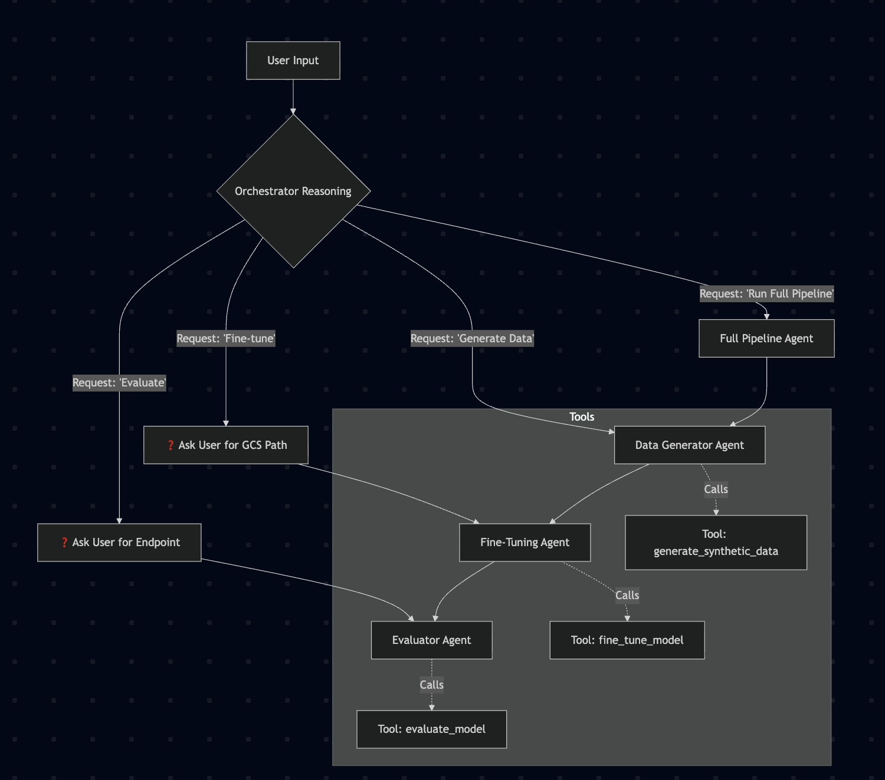

# SFT Starter Pack (NL2SQL)

## 📖 Overview

The **SFT Starter Pack (NL2SQL)** is an AI-native system built using the **Agent Development Kit (ADK)** on Google Cloud. It is designed to automate the complex, iterative engineering loop of fine-tuning Large Language Models (LLMs).

As enterprise Generative AI needs shift from proof-of-concept to production, standard prompting is often insufficient. Fine-tuning is required but is traditionally a manual, resource-intensive bottleneck. This project reimagines that workflow: instead of a human manually managing data generation, training jobs, and evaluation, this Agent autonomously plans and executes tasks to achieve a specific accuracy goal.

This solution, as of today, supports NL2SQL use cases on BigQuery Google SQL. In future, it can and will be extended to
any other applicable fine tuning use cases.

### Core Philosophy

  * **From Manual to Autonomous:** Moves from step-by-step human execution to goal-oriented agentic execution.
  * **Reasoning Engine:** Uses Gemini to plan, execute, and iterate.
  * **Self-Correction:** If target accuracy is not met, the agent autonomously decides to generate more data, refine the dataset, or retune parameters.

## 🏗 Architecture

## 🧠 Agent Architecture & Workflow

This system utilizes a **Hierarchical Multi-Agent Architecture**. A central "Orchestrator" receives user intent and delegates execution to specialized sub-agents. This separation of concerns allows for modular improvements to individual components (e.g., upgrading the Data Generator) without breaking the overall pipeline.

### 1\. The Orchestrator (`ROOT_PROMPT`)

The Orchestrator acts as the intelligent router. It does not perform technical tasks itself; rather, it analyzes the user's natural language request to determine the correct execution path.

It manages a team of four distinct agents:

| Agent Name | Trigger Condition | Behavior |
| :--- | :--- | :--- |
| **`full_pipeline_agent`** | "Run full pipeline", "End-to-end" | **Sequential Execution:** Chains Data Gen $\to$ Fine-Tuning $\to$ Evaluation automatically. |
| **`data_generator_agent`** | "Generate data" | **Immediate Delegation:** Calls the specialist agent directly. |
| **`fine_tuner_agent`** | "Fine-tune a model" | **Interactive Delegation:** First *asks* the user for the Training Data GCS Path, then delegates. |
| **`evaluator_agent`** | "Evaluate a model" | **Interactive Delegation:** First *asks* the user for the Model Endpoint, then delegates. |

### 2\. Specialist Sub-Agents

Each sub-agent is a self-contained unit with access to specific ADK tools and a shared state context (configuration variables).

#### 🔹 Data Generator Agent

  * **Role:** Synthesizes training data for fine-tuning.
  * **Tool Used:** `generate_synthetic_data`
  * **Operational Flow:**
    1.  Receives control from the Orchestrator.
    2.  **State Extraction:** It automatically pulls required configuration (`project_id`, `bq_dataset_id`, `seed_data_path`, `target_examples`) from the agent state.
    3.  **Execution:** It calls the synthesis tool to generate examples and save them to GCS.
    4.  **Output:** Returns the path to the newly generated dataset.

#### 🔹 Fine-Tuner Agent

  * **Role:** Manages the Vertex AI Supervised Fine-Tuning (SFT) job.
  * **Tool Used:** `fine_tune_model`
  * **Operational Flow:**
    1.  **Human-in-the-Loop:** If triggered directly, it pauses to request the `training_dataset_gcs_path` from the user.
    2.  **State Extraction:** Pulls infrastructure config (`base_model`, `project_id`, `gcp_location`) from the state.
    3.  **Execution:** Submits the SFT job to Vertex AI.
    4.  **Output:** Returns the Job ID and status.

#### 🔹 Evaluator Agent

  * **Role:** Scores the fine-tuned model against the ground truth.
  * **Tool Used:** `evaluate_model`
  * **Operational Flow:**
    1.  **Human-in-the-Loop:** If triggered directly, it pauses to request the `model_endpoint_resource_name` from the user.
    2.  **State Extraction:** Pulls test config (`eval_dataset_path`, `gcs_bucket_name`) from the state.
    3.  **Execution:** Runs inference against the test set and calculates metrics.
    4.  **Output:** Returns an evaluation report (Accuracy, Precision, Recall, etc.).

### 🔄 Execution Flow Diagram

The following diagram illustrates how the Orchestrator routes requests based on the prompts defined in `src/prompts.py`:



*(Figure 1: Orchestrator routing logic and agent delegation flow)*

### The Sub-Agents

1.  **Data Generator (`src/sub_agents/data_generator`):** Analyzes seed data (20-50 examples) and employs strategies to generate high-quality, scaled-up datasets (thousands of examples).
2.  **Fine-Tuner (`src/sub_agents/fine_tuner`):** Programmatically initiates and monitors Supervised Fine-Tuning (SFT) jobs on Vertex AI (e.g., Gemini Flash).
3.  **Evaluator (`src/sub_agents/evaluator`):** Tests the fine-tuned model against ground truth data, generates metrics, and provides actionable feedback to the Orchestrator.

## ✅ Prerequisites & Assumptions

Before running the agent, ensure the following data prerequisites are met:

  * **Mandatory:** A "Seed Set" of **20-30 input-output examples**. The agent uses this to understand the domain and style for synthetic generation.
  * **Recommended:** A "Ground Truth Set" of **30-50 questions/answers** for evaluation.
  * **Google Cloud Project:** A GCP project with Vertex AI API enabled.

## 🚀 Getting Started

### 1\. Installation

This project uses modern Python tooling. Ensure you have Python 3.10+ installed.

```bash
# Clone the repository
git clone <repo-url>
cd <repo-name>

# Install uv if you haven't already
pip install uv

# Sync dependencies creates the venv and installs packages automatically
uv sync

# Activate the environment
source .venv/bin/activate
```

### 2\. Infrastructure Setup

We provide an automated script to bootstrap your Google Cloud environment. This script prepares the project for containerized deployment on Cloud Run.

**What this script does:**

  * 🔐 **Authenticates** your local `gcloud` CLI and Application Default Credentials (ADC).
  * 🔌 **Enables APIs:** Cloud Run, Cloud Build, and Artifact Registry.
  * 📦 **Creates Repository:** Sets up a Docker repository named `sft-runner-starter-pack` in `us-central1`.
  * 🛡️ **Configures IAM:** Grants the default Compute Engine Service Account permissions to manage Cloud Run services and write to the Artifact Registry.

> **Note:** We expect that you already have a BigQuery dataset with tables/views which correspond to the actual Business data, pertaining to your
use case, which would be the `baseline` for the Fine tuned model to generate SQL Queries by understanding its metadata information.

**Run the initialization script:**

```bash
# Make the script executable
chmod +x one_time_setup.sh

# Run the setup (You will be prompted to log in via browser)
./one_time_setup.sh
```

> **Note:** The script defaults to the `us-central1` region for the Artifact Registry. If you require a different region, please edit the `--location` flag in `one_time_setup.sh` before running.

### 3\. Configuration

1.  Review `src/config.py` to set your Project ID and Region, along with path to seed data.
2.  Ensure `tools.yaml` defines the specific tool definitions required for the ADK execution. 

Update `YOUR-PROJECT-ID` with your actual GCP Project ID in the `tools.yaml` file.

## 💻 Usage

### Preparing Data

Place your datasets in the `src/data/` directory:

  * `seed_queries.csv`: Your small set of examples.
  * `eval_queries.csv`: Your ground truth for testing.

### 🖥️ Running the Application

This project includes a web-based Chat Interface built with **Streamlit**. It provides a user-friendly dashboard to interact with the Orchestrator Agent, view streaming responses, and manage session states.

**To launch the User Interface:**

```bash
streamlit run app.py
```

**What to expect:**

1.  **Browser Launch:** The command will automatically open your default web browser to `http://localhost:8501`.
2.  **Initialization:** On the first run, the app will initialize the Vertex AI SDK and the ADK Runner (this may take a few seconds).
3.  **Sidebar:** You will see a sidebar displaying your unique **User ID** and **Session ID**. You can click **"Start New Chat Session"** to reset the conversation context.

**Troubleshooting:**
If the browser does not open automatically, look at the terminal output and click the `Network URL` or `Local URL` provided.

## ☁️ Deployment (Cloud Run)

This project uses **Google Cloud Build** to automate the deployment pipeline. The application is containerized using Docker and deployed as a serverless service on **Google Cloud Run**.

### 1\. Pre-Deployment Configuration

**⚠️ Important:** Before deploying, you must update the build configuration to match your Google Cloud environment.

Open `cloudbuild.yaml` and modify the `substitutions` section at the bottom of the file:

```yaml
# cloudbuild.yaml
substitutions:
  _SERVICE_NAME: 'sft-runner-starter-pack'  # Name of the Cloud Run service
  _REGION: 'us-central1'                    # Deployment region
  _AR_HOST: 'us-central1-docker.pkg.dev'    # Artifact Registry Host
  _REPO_NAME: 'sft-runner-starter-pack'     # Must match the repo created in setup
  _PROJECT_ID: 'YOUR-PROJECT-ID-HERE'       # Replace with your Project ID
```

Additionally, open [`.env`](src/.env) file and update 
- `YOUR-PROJECT-ID` with your actual GCP Project ID.
- `YOUR-BQ-DATASET-ID` with the actual BQ dataset where you have your data tables/views.
- `YOUR-BUCKET-ID` with the actual temporary GCS Bucket which the application will use.

> **Note:** By BigQuery dataset above, we refer to the tables which contain the actual data on which the Fine tuned
model is finally supposed to generate SQL on. This application, by its design, will incorporate the available metadata
of the available tables and views to generate SQL Queries for any given question. 

### 2\. The Deployment Pipeline

The `deploy.sh` script triggers a Cloud Build job that performs three specific steps:

1.  **Build:** Creates a Docker image based on `python:3.13-slim`, installing all dependencies defined in `requirements.txt`.
2.  **Push:** Uploads the tagged image to your Artifact Registry.
3.  **Deploy:** Releases the image to Cloud Run as a managed service on port `8080`.

### 3\. Triggering the Deployment

Ensure you are in the root of the git repository and have authenticated with Google Cloud.

```bash
# Make the script executable (if not already)
chmod +x deploy.sh

# Run the deployment
./deploy.sh
```

**What happens next?**

  * The script calculates the current Git Commit SHA (`SHORT_SHA`) to tag the Docker image (ensuring version control traceability).
  * Logs will stream in your terminal showing the build progress.
  * Upon success, the script will output a **Service URL** (e.g., `https://sft-runner-starter-pack-xyz.a.run.app`).

### 4\. Container Details (`Dockerfile`)

The application runs inside a secure, non-root container environment:

  * **Base Image:** `python:3.13-slim` for a lightweight footprint.
  * **Security:** Runs as a non-privileged user (`myuser`).
  * **Port:** Exposes port `8080` (Streamlit default).
  * **Context:** Copies the local directory into the image.

> **Note on Environment Variables:**
> Since the `Dockerfile` copies local files (`COPY . .`), your local `.env` file will be included in the container. For production environments, it is recommended to exclude `.env` via `.dockerignore` and set secrets directly in the Cloud Run configuration using Google Secret Manager.

## 📂 Project Structure

```text
├── ./__init__.py
├── ./app.py
├── ./CHANGELOG.md
├── ./cloudbuild.yaml
├── ./CODE_OF_CONDUCT.md
├── ./CONTRIBUTING.md
├── ./deploy.sh
├── ./Dockerfile
├── ./LICENSE
├── ./one_time_setup.sh
├── ./pyproject.toml
├── ./README.md
├── ./requirements.txt
├── ./SECURITY.md
├── ./src
│   ├── ./src/__init__.py
│   ├── ./src/agent.py
│   ├── ./src/config.py
│   ├── ./src/data
│   │   ├── ./src/data/eval_queries.csv
│   │   ├── ./src/data/sample_eval_queries.csv
│   │   ├── ./src/data/seed_queries.csv
│   │   └── ./src/data/test_data.csv
│   ├── ./src/prompts.py
│   ├── ./src/sub_agents
│   │   ├── ./src/sub_agents/__init__.py
│   │   ├── ./src/sub_agents/data_generator
│   │   │   ├── ./src/sub_agents/data_generator/__init__.py
│   │   │   ├── ./src/sub_agents/data_generator/agent.py
│   │   │   ├── ./src/sub_agents/data_generator/prompt.py
│   │   │   └── ./src/sub_agents/data_generator/tool.py
│   │   ├── ./src/sub_agents/evaluator
│   │   │   ├── ./src/sub_agents/evaluator/__init__.py
│   │   │   ├── ./src/sub_agents/evaluator/agent.py
│   │   │   ├── ./src/sub_agents/evaluator/prompt.py
│   │   │   └── ./src/sub_agents/evaluator/tool.py
│   │   └── ./src/sub_agents/fine_tuner
│   │       ├── ./src/sub_agents/fine_tuner/__init__.py
│   │       ├── ./src/sub_agents/fine_tuner/agent.py
│   │       ├── ./src/sub_agents/fine_tuner/prompt.py
│   │       └── ./src/sub_agents/fine_tuner/tool.py
│   └── ./src/utils
│       ├── ./src/utils/__init__.py
│       └── ./src/utils/mcptoolbox_client.py
├── ./tools.yaml
```

## Contributing

Contributions to this library are always welcome and highly encouraged.

See [CONTRIBUTING](CONTRIBUTING.md) for more information how to get started.

Please note that this project is released with a Contributor Code of Conduct. By participating in
this project you agree to abide by its terms. See [Code of Conduct](CODE_OF_CONDUCT.md) for more
information.

## License

```
# Copyright 2025 Google LLC
#
# Licensed under the Apache License, Version 2.0 (the "License");
# you may not use this file except in compliance with the License.
# You may obtain a copy of the License at
#
#     http://www.apache.org/licenses/LICENSE-2.0
#
# Unless required by applicable law or agreed to in writing, software
# distributed under the License is distributed on an "AS IS" BASIS,
# WITHOUT WARRANTIES OR CONDITIONS OF ANY KIND, either express or implied.
# See the License for the specific language governing permissions and
# limitations under the License.
```